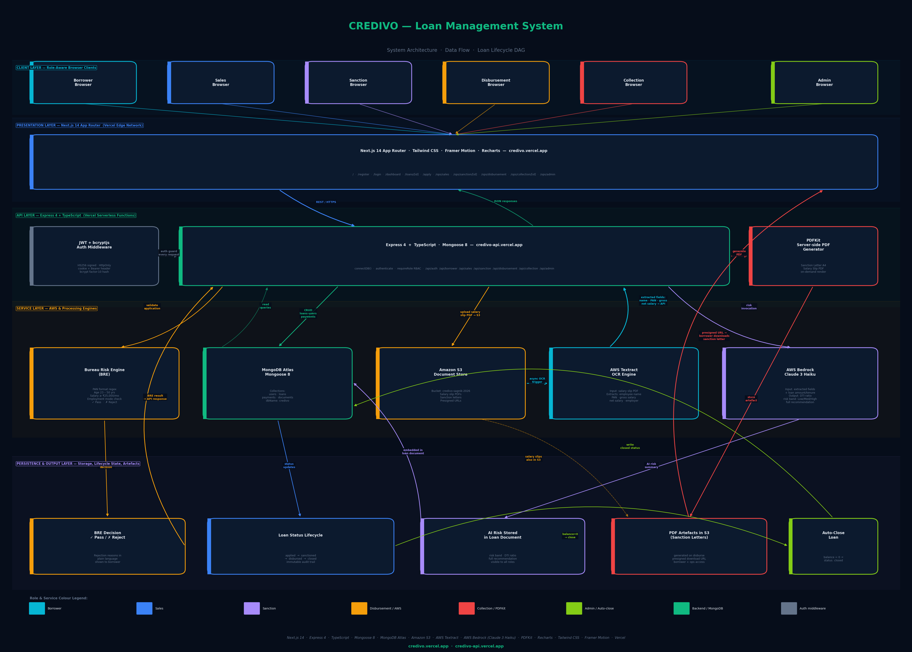

<div align="center">
  <h1>⚡ Credivo — Loan Management System</h1>
  <p><strong>India's next-generation lending operations platform.</strong><br/>
  AI-powered credit evaluation, AWS Textract OCR, Bedrock risk summaries, and real-time loan lifecycle management — all in one premium console.</p>

  <a href="https://credivo.vercel.app"></a>
  &nbsp;
  <a href="https://credivo-api.vercel.app"></a>
  &nbsp;
  
</div>

---

## 🎬 Demo Video

> Full walkthrough — all 6 roles, every page, automated login & scroll.
> Generated with **Playwright** (browser recording) + **Microsoft Edge Neural TTS** voice narration + **FFmpeg** composite.

📹 **[`demo/final_demo.mp4`](demo/final_demo.mp4)** — 9 MB · ~5 min · 1280×720 · `en-US-AndrewMultilingualNeural` narration

Video drive link - https://drive.google.com/file/d/1QIVqU-tiP0gHxNTnProuxR7oOomlmReA/view?usp=sharing

---

## 🗺 Architecture



---

## ✨ Features at a Glance

| Layer | What it does |
|---|---|
| **Borrower Portal** | Register, BRE eligibility check, salary slip upload (S3), loan application wizard, live status tracker |
| **Bureau Risk Engine** | Server-side rules: PAN format, age 23–50, salary ≥ ₹25k, employment mode — real-time rejection reasons |
| **AWS Textract OCR** | Extracts employee name, PAN, gross & net salary from uploaded PDF salary slips |
| **AWS Bedrock AI** | Claude 3 Haiku generates risk summaries with DTI ratio, Low/Medium/High classification & sanction recommendation |
| **Sales Dashboard** | 14-day lead funnel, BRE metrics, employment mix, age distribution, rejection reason analysis |
| **Sanction Dashboard** | Approval queue, AI risk review, salary slip inline viewer, daily decisions chart, risk mix donut |
| **Disbursement Dashboard** | Release queue, TAT analytics, sanction letter PDF generation (PDFKit), daily & lifetime charts |
| **Collection Dashboard** | Payment recording, repayment progress cards, outstanding aging, collection efficiency gauge |
| **Admin Dashboard** | Global portfolio overview — all roles' data in one view |
| **RBAC** | Every API endpoint enforces `authenticate` + `requireRole(...)` — 403 for any cross-role call |
| **Serverless DB** | Cached-promise MongoDB connection, `bufferCommands: false`, middleware-level await — zero cold-start timeouts |

---

## 🔐 Login Credentials

| Role | Email | Password |
|---|---|---|
| Admin | admin@credivo.com | Admin@123 |
| Sales | sales@credivo.com | Sales@123 |
| Sanction | sanction@credivo.com | Sanction@123 |
| Disbursement | disburse@credivo.com | Disburse@123 |
| Collection | collect@credivo.com | Collect@123 |
| Borrower (×8) | rahul.sharma@email.com … kavya.nair@email.com | Borrower@123 |

Full list → [`credentials.txt`](credentials.txt)

---

## 🏗 Project Structure

```
credivo/
├── backend/               Express 4 + TypeScript API
│   ├── src/
│   │   ├── config/        db.ts (serverless-safe MongoDB)
│   │   ├── middleware/    auth.ts, rbac.ts
│   │   ├── models/        User, Loan, Payment, Document
│   │   ├── routes/        auth, borrower, sales, sanction, disbursement, collection, admin
│   │   ├── services/      s3.ts, textract.ts, bedrock.ts, pdf.ts, loanCalculator.ts
│   │   └── scripts/       seed.ts (PDFKit salary slips + S3 upload + Atlas seed)
│   └── vercel.json
│
├── frontend/              Next.js 14 App Router
│   ├── app/
│   │   ├── (public)/      page.tsx (landing), login/, register/
│   │   ├── dashboard/     Borrower dashboard
│   │   ├── loans/         Loan list + detail + apply wizard
│   │   └── ops/           sales/, sanction/, disbursement/, collection/, admin/
│   ├── components/        StatCard, Charts (Recharts wrappers), Sidebar, LoanStatusBadge
│   └── lib/               api.ts (axios), useAuth.ts, formatters.ts
│
├── demo/                  Demo production artefacts
│   ├── final_demo.mp4     ← finished video
│   ├── architecture.png   ← architecture diagram
│   ├── narration.py       Narration script with timestamps
│   ├── generate_tts.py    edge-tts audio generation
│   ├── record_video.py    Playwright browser recording
│   ├── combine.py         ffmpeg video + audio combiner
│   └── gen_architecture.py  Matplotlib architecture diagram
│
└── credentials.txt        All login IDs and passwords
```

---

## 🚀 Backend

### Tech Stack
| Package | Version | Purpose |
|---|---|---|
| Express | 4.x | HTTP server |
| TypeScript | 5.x | Type safety |
| Mongoose | 8.x | MongoDB ODM |
| MongoDB Atlas | — | Database (dbName: `credivo`) |
| `@aws-sdk/client-s3` | v3 | Document storage |
| `@aws-sdk/client-textract` | v3 | Salary slip OCR |
| `@aws-sdk/client-bedrock-runtime` | v3 | AI risk (Claude 3 Haiku) |
| PDFKit | 0.15 | Sanction letter + salary slip PDF |
| bcryptjs | 2.x | Password hashing |
| jsonwebtoken | 9.x | JWT (cookie + Bearer) |
| multer | 1.x | Multipart file upload |

### Local Setup

```bash
cd backend
cp .env.example .env   # fill in MongoDB URI, AWS keys, JWT secret
npm install
npm run dev            # ts-node-dev watch mode
```

### Environment Variables

```env
MONGODB_URI=mongodb+srv://...
JWT_SECRET=your_secret_here
JWT_EXPIRES_IN=7d
AWS_ACCESS_KEY_ID=...
AWS_SECRET_ACCESS_KEY=...
AWS_REGION=us-east-1
S3_BUCKET=credivo-sagnik-2026
BEDROCK_MODEL_ID=anthropic.claude-3-haiku-20240307-v1:0
```

### Seeding

```bash
npm run seed   # clears Atlas + inserts 5 executives + 8 borrowers + loans + real PDFs
```

### API Routes

| Prefix | Auth Required | Roles |
|---|---|---|
| `POST /api/auth/login` | No | — |
| `POST /api/auth/register` | No | — |
| `/api/borrower/*` | Yes | `borrower` |
| `/api/sales/*` | Yes | `sales`, `admin` |
| `/api/sanction/*` | Yes | `sanction`, `admin` |
| `/api/disbursement/*` | Yes | `disbursement`, `admin` |
| `/api/collection/*` | Yes | `collection`, `admin` |
| `/api/admin/*` | Yes | `admin` |

### Key Endpoints

```
GET  /api/sales/stats              → 14d daily, funnel, employmentMix, ageBuckets, topRejectionReasons
GET  /api/sanction/stats           → daily, riskMix, queueAging, principalBuckets, approvalRate
GET  /api/disbursement/stats       → daily, queueAging, avgTAT, lifetimeDisbursed
GET  /api/collection/stats         → daily, aging, progress, collectionEfficiency, avgDaysToClose
GET  /api/admin/dashboard          → global totals across all collections
POST /api/borrower/apply           → runs BRE, creates loan
POST /api/borrower/upload-salary-slip → S3 upload + Textract OCR + Bedrock AI risk
POST /api/sanction/approve/:loanId → sanctions loan, triggers AI risk if not yet done
POST /api/disbursement/disburse/:loanId → releases funds, generates sanction letter PDF
POST /api/collection/record-payment → records UTR payment, auto-closes on full repayment
```

### Deploy to Vercel

```bash
vercel --prod --yes
```

---

## 🖥 Frontend

### Tech Stack
| Package | Version | Purpose |
|---|---|---|
| Next.js | 14.2.13 | App Router, SSR/CSR hybrid |
| React | 18.x | UI |
| Tailwind CSS | 3.x | Utility styling |
| Framer Motion | 11.x | Page + element animations |
| Recharts | 2.x | Analytics charts (Line, Bar, Pie/Donut) |
| axios | 1.x | API calls (with JWT cookie) |
| lucide-react | — | Icons |
| react-hot-toast | — | Notifications |
| react-dropzone | — | Salary slip file upload |
| js-cookie | 3.x | JWT token management |

### Local Setup

```bash
cd frontend
cp .env.local.example .env.local   # set NEXT_PUBLIC_API_URL
npm install
npm run dev
```

### Environment Variables

```env
NEXT_PUBLIC_API_URL=https://credivo-api.vercel.app
```

### Role-based Pages

| Route | Accessible by | Description |
|---|---|---|
| `/` | Public | Landing page with feature highlights |
| `/register` | Public | Borrower registration |
| `/login` | Public | All roles (JWT cookie issued) |
| `/dashboard` | Borrower | Loan status card, quick actions |
| `/loans` | Borrower | All loans list |
| `/loans/[loanId]` | Borrower | Detailed loan view + AI risk summary |
| `/apply` | Borrower | Multi-step loan application wizard |
| `/ops/sales` | Sales, Admin | Leads table + analytics charts |
| `/ops/sanction` | Sanction, Admin | Pending queue + full review page |
| `/ops/sanction/[loanId]` | Sanction, Admin | Approve/Reject with salary slip viewer |
| `/ops/disbursement` | Disbursement, Admin | Release queue + history + sanction letter download |
| `/ops/collection` | Collection, Admin | Active loans + payment recording |
| `/ops/collection/[loanId]` | Collection, Admin | Loan detail + record payment |
| `/ops/admin` | Admin | Global dashboard |

### Deploy to Vercel

```bash
vercel --prod --yes
```

---

## 🔄 Data Flow

```
Borrower registers
       ↓
BRE runs server-side (PAN · Age · Salary · Employment)
       ↓ pass
Upload salary slip → S3 → Textract OCR → extract salary / PAN / name
       ↓
Loan created (status: applied)
       ↓
Sanction queue → AI Risk (Bedrock Claude 3 Haiku) → Low/Medium/High
       ↓  approve
Loan status: sanctioned
       ↓
Disbursement queue → fund release → PDFKit Sanction Letter → S3
       ↓
Loan status: disbursed
       ↓
Collection → record UTR payments → outstanding balance decrements
       ↓  balance = 0
Loan auto-closes (status: closed)
```

---

## 🛡 Security

- **JWT** — signed with `HS256`, stored as `HttpOnly` cookie; also accepted as `Authorization: Bearer` header
- **RBAC** — every protected router uses `router.use(authenticate, requireRole(...))` as the very first middleware; hiding a UI element is never sufficient
- **bcryptjs** — passwords hashed with cost factor 10; plain text never stored or logged
- **bufferCommands: false** — MongoDB operations fail fast instead of buffering on serverless cold starts
- **Input validation** — BRE runs server-side; all loan fields validated before persistence

---

## 📦 Demo Production

All scripts are in `demo/`. Run the full pipeline:

```bash
# 1. Install deps (once)
pip install edge-tts playwright matplotlib Pillow
python -m playwright install chromium

# 2. Run everything
python demo/run_all.py
```

Outputs:
- `demo/architecture.png` — architecture diagram
- `demo/narration_full.mp3` — full TTS narration (en-US-AndrewMultilingualNeural)
- `demo/recording/*.webm` — raw browser recording
- `demo/final_demo.mp4` — final composite video

---

## 📄 License

MIT © 2026 Credivo
